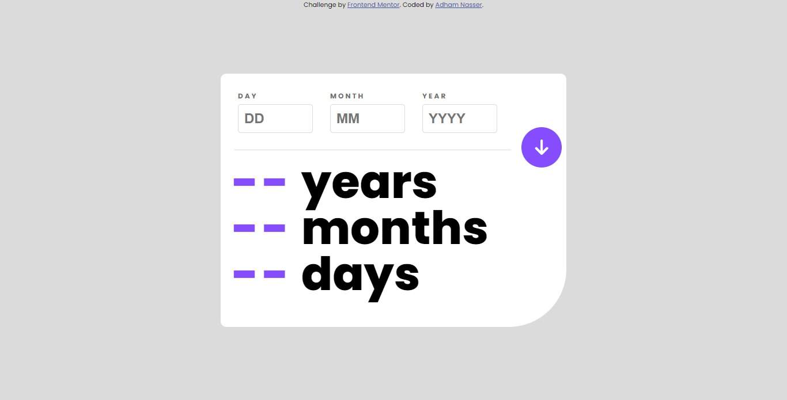

# Age Calculator App

A simple Age Calculator web application that allows users to calculate their age based on the provided birthdate.

## Table of Contents

- [Overview](#overview)
- [Features](#features)
- [Demo](#demo)
- [Technologies Used](#technologies-used)
- [Challenges and Learning](#challenges-and-learning)
- [Contributions](#contributions)
- [Contact](#contact)

## Overview

The Age Calculator App is a web-based tool that takes a user's birthdate input and calculates their age in years, months, and days. The app provides a user-friendly interface where users can input their birthdate and receive an immediate calculation of their age. This project was completed as part of the Frontend Mentor challenge, which aims to enhance frontend development skills by providing real-world design and coding projects.

## Features

- Calculate age based on birthdate input.
- Display the calculated age in years, months, and days.
- Responsive design for various screen sizes.

## Demo

You can see the live demo of the Age Calculator App [here](https://age-calculator-seven-xi.vercel.app/).

## Technologies Used

- HTML
- CSS
- JavaScript

## Challenges and Learning

This project was completed as part of the Frontend Mentor challenge. During the development of this app, I learned:
- How to create a responsive layout using CSS Flexbox and Media Queries.
- How to validate user input and handle error messages in JavaScript.
- How to calculate age based on birthdate using JavaScript's Date object.
- How to utilize Font Awesome icons to enhance the user interface.

## Contributions

Contributions are welcome! If you find any bugs or have suggestions for improvements, feel free to create an issue or a pull request.

## Contact

- GitHub: [Adham Nasser](https://github.com/Adham-XIII)
- Email: [adhamxiii10@gmail.com](mailto:adhmxiii10@gmail.com)
